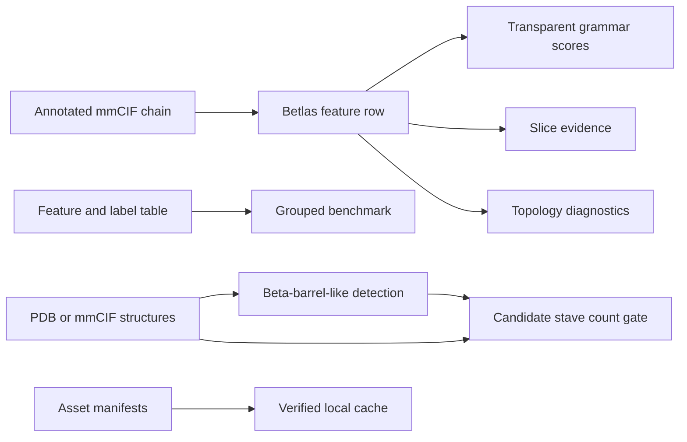

# Betlas

Betlas is a Python toolkit for beta-structure geometry grammars, transparent
fold-rule scores, grouped benchmarks, and secondary readouts for
beta-barrel-like geometry, candidate stave counts, and topology diagnostics.

Betlas is designed around explicit tables. You provide annotated structures or
feature tables; Betlas writes CSV/JSON outputs with parse status, provenance,
grammar features, rule scores, readout evidence, and benchmark manifests.

## What Betlas Produces



| You provide | Betlas writes | Use it for |
| --- | --- | --- |
| One annotated `.cif` or `.mmcif` chain | One-row feature CSV plus manifest | Single-structure grammar analysis |
| Feature CSV | Rule-score CSV plus manifest | Transparent fold-rule inspection |
| Annotated structure chain | Slice summary, slice rows, residue-traceable points | Auditing slice-dependent grammars |
| Feature and label CSV | Benchmark metrics, out-of-fold prediction CSV, preflight JSON | Model and feature evaluation |
| PDB/mmCIF files | Beta-barrel-like chain decisions | Geometry readout screening |
| Detection CSV plus structures | Candidate stave-count table | Strand/stave evidence for barrel-like chains |
| Packaged asset manifests | Verified cached files | Fixed-cohort readout workflows |

## Install

Current development builds are best used from a source checkout:

```bash
python -m venv .venv
source .venv/bin/activate
python -m pip install -U pip
python -m pip install -e .
betlas --help
```

Optional extras are installed only for packaged workflows that need them:
`.[ml]` for tuned XGBoost benchmark configs and `.[dev]` for local test/build
tooling. Repository companion fixed-cohort runners are source-tree workflows;
install CatBoost explicitly for those runs with `python -m pip install catboost`.

For a local wheel built from this source tree:

```bash
python -m pip install build
python -m build
python -m pip install dist/betlas-1.0.0-py3-none-any.whl
```

Future tagged releases may also be installed from PyPI with
`python -m pip install betlas`. Before that release is published, use source
install or a local wheel from this checkout.

Runtime requirements:

- Python `>=3.10`.
- `mkdssp`/DSSP for beta-barrel detection and candidate stave counting.
- `xgboost` only when the configured benchmark requests the tuned XGBoost
  model family.
- CatBoost only for repository companion fixed-cohort supervised runners under
  `scripts/reproducibility/readout_benchmarks`.
- ESM-C weights are never redistributed by Betlas; workflows that need them
  resolve a user-provided local path.

Check DSSP availability:

```bash
conda install -c conda-forge dssp
betlas readout beta-barrel-detection --check-env
betlas readout beta-barrel-staves --check-env
```

## Start With Your Data

| Data state | Recommended first command | Notes |
| --- | --- | --- |
| Annotated mmCIF with `_struct_sheet_range` records | `betlas extract-features --structure STRUCTURE.cif --chain A --out runs/features.csv` | Best path for grammar features and slice evidence. |
| PDB or AlphaFold-style structure without sheet records | `betlas readout beta-barrel-detection STRUCTURE.pdb --out runs/detection.csv` | DSSP-based readouts can operate on PDB/mmCIF inputs. Grammar extraction expects mmCIF sheet annotations. |
| CATH source files | `betlas build-dataset --all-eligible --out runs/labels.csv` | Produces labels and grouping columns for benchmarks. If required files are absent from `--cath-dir`, Betlas downloads current CATH daily files; use a pinned local mirror for reproducible release runs. |
| Feature CSV with labels | `betlas benchmark --features runs/features.csv --out-dir runs/benchmark` | Rows with `betlas_parse_ok != 1` are filtered from benchmark fits. |
| Feature CSV without labels | `betlas grammar score --features runs/features.csv --out runs/rule_scores.csv` | Requires parse-ok rows and grammar input columns by default. |
| Prediction CSV from another model | `betlas readout topology-diagnostics --features runs/features.csv --predictions runs/predictions.csv --out runs/topology.csv` | Explicit missing prediction files fail. |
| Local mirror of Betlas assets | `BETLAS_ASSET_BASE_URL=/mirror/betlas-assets betlas assets download ASSET_ID` | Required while packaged manifests report `pending_release`. |

## Quickstart

The installed package includes a tiny annotated mmCIF example. It is for smoke
testing the public workflow, not for biological interpretation.

```bash
mkdir -p runs/examples
betlas examples copy mini --out-dir runs/examples

betlas extract-features \
  --structure runs/examples/mini.cif \
  --chain A \
  --out runs/examples/mini_features.csv

betlas grammar score \
  --features runs/examples/mini_features.csv \
  --out runs/examples/mini_rule_scores.csv

betlas slice runs/examples/mini.cif \
  --chain A \
  --out runs/examples/mini_slices.csv \
  --points-out runs/examples/mini_slice_points.csv \
  --summary-out runs/examples/mini_slice_summary.json
```

Expected quick checks:

```bash
python - <<'PY'
import pandas as pd

features = pd.read_csv("runs/examples/mini_features.csv")
scores = pd.read_csv("runs/examples/mini_rule_scores.csv")
points = pd.read_csv("runs/examples/mini_slice_points.csv")

print(features[["record_id", "chain_id", "betlas_parse_ok"]].to_string(index=False))
print([c for c in scores.columns if c.startswith("betlas_rule_score_")][:4])
print(points[["auth_seq_id", "residue_uid", "strand_id", "sheet_id"]].head().to_string(index=False))
PY
```

## Betlas Concepts

| Concept | Meaning |
| --- | --- |
| Geometry grammar | A deterministic family of beta-structure features such as sheet geometry, contact topology, angular closure, or axis periodicity. |
| Fold-rule score | A transparent score computed from Betlas feature columns for one fold label. It is not a trained probability. |
| Parse status | `betlas_parse_ok=1` marks rows that passed structure parsing and feature extraction. Public scoring and benchmark paths reject or filter failed rows by default. |
| Slice evidence | Axis-aligned z-bin summaries used by closure and stave-style grammars. Slice points preserve residue, strand, sheet, and chain traceability. |
| Readout | A secondary workflow that turns structures or feature tables into focused evidence tables. |
| Asset manifest | A packaged YAML file containing file names, byte sizes, SHA-256 hashes, release status, and release-relative download paths. |

## Input Contracts

### Structures

Grammar extraction and slicing accept annotated mmCIF inputs:

- `.cif`
- `.mmcif`
- `.cif.gz`
- `.mmcif.gz`

These workflows read author chain ids and mmCIF secondary-structure records
such as `_struct_sheet_range` and `_struct_conf`. A structure that lacks usable
beta-sheet segments is treated as a failed or non-informative input, not as a
successful all-zero result. Selected grammar/slice residues must currently use
numeric author residue IDs; insertion-coded residues are rejected instead of
being silently dropped.

Beta-barrel detection and candidate stave counting accept:

- `.pdb`
- `.pdb.gz`
- `.cif`
- `.cif.gz`
- `.mmcif`
- `.mmcif.gz`

Both readouts analyze all chains by default. Use `--chain CHAIN_ID` to restrict
analysis to one chain.

### Label CSV

Batch feature extraction expects one row per domain or chain. Required columns:

| Column | Meaning |
| --- | --- |
| `record_id` | Stable row identifier. |
| `pdb_id` | PDB id used to locate or download mmCIF files. |
| `chain_id` | Author chain id. |
| `domain_id` | Domain or chain-level identifier. |
| `residue_ranges` | Optional residue range expression such as `10-180:A`. |
| `fold_label_final` | Fold label used by benchmark and ablation workflows. |

Benchmark grouping uses the first non-empty value from
`cath_s35_cluster_id`, `cath_homology_code`, then `pdb_id`.

### Feature CSV

Feature tables contain identifiers, optional labels, parse status, provenance,
and `betlas_*` geometry columns.

Important columns:

| Column | Meaning |
| --- | --- |
| `record_id`, `pdb_id`, `chain_id`, `domain_id` | Row identity and joins. |
| `fold_label_final` | Required for benchmark and ablation workflows. |
| `betlas_parse_ok` | `1` means the row is usable for public scoring and benchmark paths. |
| `betlas_error`, `betlas_warnings` | Structured parsing and extraction diagnostics. |
| `source_mmcif_path`, `source_mmcif_sha256`, `source_mmcif_size` | Structure provenance when available. |
| `betlas_axis_best_*` | Best-axis closure and slice summaries. |
| `betlas_rule_score_<fold>` | Transparent fold-rule score columns, when present or generated. |

Inspect the data dictionary:

```python
from betlas import describe_column, describe_feature, list_column_specs

print(describe_feature("betlas_axis_best_score").formula)
print(describe_column("source_mmcif_sha256").definition)
print(len(list_column_specs()))
```

### Prediction CSV

Topology diagnostics can consume an optional prediction table. It should
contain a join key such as `record_id` or `domain_id`, a `model` column when
multiple models are present, and either probability-like columns named
`prob_<fold_label>` or a top-label confidence column named `pred_probability`.
If `--predictions` is omitted, Betlas derives
uncalibrated rule-softmax weights from transparent rule scores and marks the
source/calibration columns accordingly. If `--predictions PATH` is provided and
the file is missing, the command fails.

### Asset Mirror

An asset mirror must match the manifest `download_path` layout. For example:

```text
/mirror/betlas-assets/
  beta_barrel_detection/official/betlas_151_chain_features.csv
  beta_barrel_detection/official/esmc_mean_embeddings_aligned.npz
  beta_barrel_staves/official/betlas_151_chain_features.csv
```

Use `BETLAS_ASSET_BASE_URL` or `--base-url` to point Betlas at that mirror.

## Run Betlas Workflows

### Single-Structure Grammar Workflow

```bash
betlas extract-features \
  --structure STRUCTURE.cif.gz \
  --chain A \
  --out runs/structure_features.csv

betlas grammar score \
  --features runs/structure_features.csv \
  --out runs/structure_rule_scores.csv

betlas grammar describe axis_closure
betlas grammar describe axis_periodicity --format json
```

`grammar score` rejects rows with `betlas_parse_ok != 1` by default. With
`--allow-parse-fail`, failed rows are carried through as status-only rows with
`betlas_score_status=parse_failed`; Betlas does not assign fold calls or rule
scores to parse-failed rows.

### Slice Audit

```bash
betlas slice STRUCTURE.cif \
  --chain A \
  --axis best \
  --out runs/slices.csv \
  --points-out runs/slice_points.csv \
  --summary-out runs/slice_summary.json
```

`slice` fails when no beta-sheet segment can be parsed for the selected chain.
This avoids treating a non-informative structure as a successful empty result.
If beta segments are present but the configured slice thresholds produce zero
informative z-bins, `slice_summary.json` reports
`status: no_informative_slices`; `slices.csv` is header-only because there are
no informative slice records; and `slice_points.csv` still lists projected beta
residues with `included=0` and `exclusion_reason`.

### Beta-Barrel-Like Detection And Candidate Staves

```bash
betlas readout beta-barrel-detection STRUCTURE.cif \
  --out runs/detection.csv

betlas readout beta-barrel-staves STRUCTURE.cif \
  --barrel-decisions runs/detection.csv \
  --out runs/staves.csv
```

For targeted exploratory analysis of one chain, ungated counting is available
only when requested explicitly:

```bash
betlas readout beta-barrel-staves STRUCTURE.cif \
  --chain A \
  --allow-ungated \
  --out runs/staves_A.csv
```

Interpretation boundary: `beta-barrel-detection` reports
beta-barrel-like geometry evidence. `beta-barrel-staves` reports a candidate
strand/stave count. Detection `decision_score` is positive BARREL decision
support, uses `0` for `NON_BARREL` rows, and keeps raw geometry in `score_raw`
and `score_adjust`. `decision_score` and staves `confidence` are deterministic
heuristic evidence scores, not calibrated probabilities.

The `--barrel-decisions` CSV gate is a conservative post-hoc output gate: the
staves pipeline still prepares/analyzes rows, then reports non-filtered candidate stave counts
only for matching detection `BARREL` rows. Detection `ERROR` rows remain error
status in the gated staves output.
Candidate staves are DSSP-run supported readouts. For stricter exploratory
staves analysis, use an override such as
`analyzer.layer.require_geometric_consistency=true`.

### Benchmark And Ablation

```bash
betlas benchmark \
  --features runs/features.csv \
  --out-dir runs/benchmark

betlas ablate \
  --features runs/features.csv \
  --out-dir runs/ablations
```

Public benchmark feature sets are:

| Feature set | Meaning |
| --- | --- |
| `raw_geometry` | Deterministic Betlas geometry columns excluding aggregate rule scores and diagnostic readouts. This is the default. |
| `raw_plus_rule_scores` | Raw geometry plus transparent rule-score columns. |
| `rules_only` | Transparent rule-score columns only. |

The benchmark preflight file records row filtering, class counts, group
counts, effective fold count, per-fold class/group counts, model dependency
status, and selected feature set. The exact columns used by each model are
written to `feature_columns.csv`.
The default benchmark config uses raw geometry with base scikit-learn models.
Transparent `grammar_rules` and tuned `xgboost_tuned` benchmarks are available
only through an explicit benchmark config; those configs require joined
`betlas_rule_score_*` columns or the optional `xgboost` dependency,
respectively.

### Topology Diagnostics

```bash
betlas readout topology-diagnostics \
  --features runs/features.csv \
  --out runs/topology.csv

betlas readout topology-diagnostics \
  --features runs/features.csv \
  --predictions runs/oof_predictions.csv \
  --out runs/topology_with_predictions.csv
```

Aliases are also available:

- `fold-continuous-scores`
- `topology-ambiguity`
- `mixed-topology`

## Outputs

| Workflow | File | Main question | Key fields |
| --- | --- | --- | --- |
| `extract-features` | `features.csv` | What deterministic geometry was parsed for each row? | identifiers, parse status, source hash, `betlas_*` features |
| `extract-features` | `features.csv.manifest.json` | Which command and structure files produced the table? | command, inputs, outputs, metrics, file state |
| `grammar score` | `rule_scores.csv` | Which transparent fold rules score highest? | `betlas_top_fold`, `betlas_rule_margin`, `betlas_rule_score_<fold>` |
| `grammar score` | `rule_scores.csv.manifest.json` | Was scoring strict and how many rows were parse-ok? | strict flag, allow-parse-fail flag, row counts |
| `slice` | `slice_summary.json` | Which axis and slice summaries were used? | status, identity, source hash, axis name, score, origin, direction, config thresholds, parser warnings |
| `slice` | `slices.csv` | Which z-bins are informative? | status, slice index, z bounds, coverage, largest gap; header-only when no informative slices |
| `slice` | `slice_points.csv` | Which residues were included or excluded from slice scoring? | included flag, exclusion reason, chain, residue ids, insertion code, residue name, strand and sheet ids |
| `benchmark` | `benchmark_preflight.json` | What data actually entered the benchmark? | filters, classes, groups, folds, dependencies, feature set |
| `benchmark` | `metrics_summary.csv` | How did each model perform? | accuracy, balanced accuracy, macro F1, top-2 accuracy, feature count |
| `benchmark` | `feature_columns.csv` | Which columns were used by each model? | model, feature set, feature |
| `ablate` | `ablation_preflight.json` | What rows/features entered ablation? | filters, groups, fold preflight, dependency status |
| `beta-barrel-detection` | detection CSV | Which chains show beta-barrel-like geometry? | result, stage, decision score, gates, layer evidence, reason |
| `beta-barrel-staves` | staves CSV | What candidate stave count is supported? | strand count, confidence, gate status, layer evidence, score type |
| `topology-diagnostics` | topology CSV | Which rows show boundary or mixed-topology signals? | ambiguity, probability source/calibration status, continuous topology scores, mixed-topology flags |

For readout commands, stdout is progress/status text rather than CSV content.
Always pass `--out` or the documented `output.csv=...` override when a workflow
manager or shell redirection expects a CSV file.

Readout column specs are available from Python:

```python
from betlas import describe_readout_column, list_readout_column_specs

print(describe_readout_column("decision_score", "beta-barrel-detection").definition)
print(len(list_readout_column_specs("beta-barrel-staves")))
```

Readouts are also available from Python. The staves API writes no CSV unless
`output=` or `write_csv=True` is supplied:

```python
from betlas import count_beta_barrel_staves, detect_beta_barrel_like

detection = detect_beta_barrel_like("structure.cif", output="runs/detection.csv")
staves = count_beta_barrel_staves(
    "structure.cif",
    barrel_decisions="runs/detection.csv",
    output="runs/staves.csv",
)

# Target one chain from Python with the same config key used by the CLI.
chain_a = detect_beta_barrel_like("structure.cif", overrides=["input.chain_id=A"])
```

## Assets And Reproducibility

Betlas ships asset manifests in the package. Large payloads are resolved from a
release or mirror and verified before use.

```bash
betlas assets list
betlas assets describe betlas-beta-barrel-detection-official-v1
betlas assets describe betlas-beta-barrel-staves-official-v1
```

While a manifest reports `pending_release`, default downloads fail fast. Use a
local mirror:

```bash
BETLAS_ASSET_BASE_URL=/mirror/betlas-assets \
  betlas assets download betlas-beta-barrel-detection-official-v1

betlas assets verify betlas-beta-barrel-detection-official-v1 --strict
betlas assets path betlas-beta-barrel-detection-official-v1 --file betlas_151_chain_features.csv --must-exist
```

ESM-C handling:

```bash
BETLAS_ESMC_WEIGHTS=/path/to/esmc_weights.pt betlas assets check-esmc --required
```

Betlas only resolves and checks local ESM-C paths. It does not download or
redistribute third-party model weights.

Repository companion workflows live under `scripts/`. They are source-tree
workflows, not stable Python imports. Run them from the repository root with:

```bash
PYTHONPATH=.:src python scripts/run_full_pipeline.py --help
```

Generated tables, downloaded tools, caches, and local environments should be
written under ignored run directories such as `runs/...`.

## Troubleshooting

| Symptom | Likely cause | Fix |
| --- | --- | --- |
| `grammar score refused parse-failed feature rows` | One or more rows have `betlas_parse_ok != 1`. | Inspect `betlas_error` and `betlas_warnings`; rerun extraction with a structure that has usable sheet records. |
| `strict validation failed` | Required grammar input columns are absent or nonnumeric. | Generate features with `betlas extract-features` or use `--no-strict` only for exploratory diagnostics. |
| `no beta-sheet segments` from `slice` | Selected chain lacks parsed beta-sheet segments. | Confirm chain id and mmCIF `_struct_sheet_range` records. |
| DSSP not found | `mkdssp` is missing from `PATH`. | Install DSSP and pass `runtime.dssp_bin_path=/path/to/mkdssp` when needed. |
| Asset download fails with `pending_release` | Default release payload is not available for that manifest. | Set `BETLAS_ASSET_BASE_URL` or `--base-url` to a local mirror. |
| Prediction file error in topology diagnostics | `--predictions` was provided but the file does not exist or lacks usable probability columns. | Provide the CSV or omit `--predictions` to use uncalibrated rule-softmax weights. |
| Stave command requires a gate | Broad candidate counting is intentionally not silent. | Pass `--barrel-decisions runs/detection.csv` or explicitly use `--allow-ungated`. |

## Python API

```python
from betlas import (
    compute_grammar_features,
    describe_feature,
    extract_structure_features,
    list_feature_specs,
    list_grammars,
    score_fold_grammar,
    slice_mmcif,
)

row = extract_structure_features("runs/examples/mini.cif", chain_id="A")
scores = score_fold_grammar(row)
print(row["betlas_parse_ok"], scores["beta_barrel"])
print(describe_feature("betlas_axis_best_score").formula)
print([spec.name for spec in list_grammars()])

bundle = slice_mmcif("runs/examples/mini.cif", chain_id="A")
print(bundle.axis_name, len(bundle.slices))
```

Assets:

```python
from betlas.assets import (
    describe_asset,
    list_assets,
    resolve_asset_path,
    resolve_esmc_weights,
)

print(list_assets())
print(describe_asset("betlas-beta-barrel-detection-official-v1")["release_status"])
# Plain resolve returns the expected cache location. It does not verify or
# download files unless download=True is passed with an explicit mirror/base URL.
print(resolve_asset_path("betlas-beta-barrel-detection-official-v1"))
print(resolve_esmc_weights(required=False))
```

Readout APIs are exposed for core package use. Repository companion scripts are
executables and helpers, not stable imports.

## Source-Tree Development

```bash
python -m pip install -e .
python -m pip install -e ".[dev]"  # optional: tests, lint, build checks
pytest
ruff check src tests
python -m build
```

Before building a release candidate, verify:

- `git status --short` is clean.
- `dist/` was removed before the build.
- `betlas --help` works in a fresh environment.
- Wheel and sdist contents exclude repository companion scripts, run outputs,
  tests, and large asset payloads.
- Packaged asset manifests are present and large files are not.
- Complete fixed-cohort reproduction requires a Git tag/source checkout because
  the PyPI wheel/sdist are intentionally slim package artifacts.

## Repository Layout

| Path | Role |
| --- | --- |
| `src/betlas/` | Stable package code, CLI, grammar registry, readouts, schemas, specs, package resources. |
| `src/betlas/asset_manifests/` | Packaged asset manifests used by `betlas assets`. |
| `src/betlas/example_data/` | Tiny installed examples for smoke tests. |
| `assets/` | Source-tree copy of public asset manifests and checksum metadata. |
| `scripts/external_baselines/` | Repository companion adapters for third-party methods. |
| `scripts/reproducibility/` | Repository companion runners for fixed workflows. |
| `runs/` | Suggested local output root for generated artifacts. |

## Glossary

| Term | Definition |
| --- | --- |
| CATH label | External domain classification used as a benchmark label; it is not a membrane-protein assertion. |
| Beta-barrel-like | A geometry decision based on Betlas deterministic evidence. It should not be read as a calibrated membrane-barrel probability. |
| Candidate stave count | A slice-derived count of strand/stave evidence, intended to be interpreted with detection and status columns. |
| Parse-ok row | A row whose structure parsing and feature extraction succeeded for public scoring and benchmark workflows. |
| Grammar family | A named group of deterministic features with a documented mathematical summary and declared output columns. |
| Rule score | A transparent deterministic score for a fold label. |
| Preflight | JSON summary written before fitting or long-running evaluation to expose filters, groups, dependencies, and feature sets. |

## License

Betlas is released under the MIT License.
